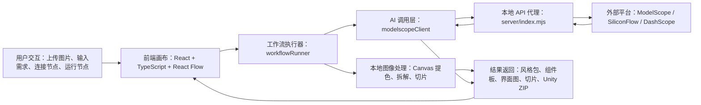

# StyleSlice 设计文档

## 1. 场景定义与需求分析

StyleSlice 面向独立游戏开发、课程原型和小团队 UI 资产生产。与普通 App UI 不同，游戏 UI 往往需要带有明确美术风格的 PNG 资源，例如按钮、面板、徽章、头像框、进度条、活动入口和装饰图标。这些资产不仅要“看起来像同一套”，还要能被切片、命名、导出并导入 Unity。对于缺少 UI 美术支持的开发者来说，从参考图分析风格、生成组件、抠图切片和整理导出是一条重复且高门槛的流程。

本项目的目标不是单纯生成一张界面参考图，而是构建一条可迭代的游戏 UI 资产流水线：用户上传 3-5 张参考图，系统通过多模态视觉模型分析色彩、材质、形状、边框、阴影和装饰语言，形成设计风格包；之后可生成原子组件板或完整界面，再进一步拆解为组件候选、Icon、底图、IP、字体等资产，最终进入切片质检和 Unity 导出。节点式画布适合这种探索式流程，因为用户经常需要回退、替换参考图、调整提示词、二次拆解或从已有生成结果继续生产。

## 2. 技术架构图



前端负责节点画布、项目管理、自动保存和结果展示。`workflowRunner.ts` 根据连线收集上游输入并执行对应节点。只需本地计算的节点，例如色板提取、基础拆解和切片，直接使用 Canvas 图像处理；涉及多模态分析或生图的节点通过 `modelscopeClient.ts` 调用本地代理。代理层统一处理 API Key、CORS、异步任务轮询和远程图片转 dataURL，避免浏览器直接暴露密钥。

## 3. 核心代码片段说明

### 3.1 通用上游图像输入

```ts
function nodeOutputImages(input: WorkflowNode): AssetImage[] {
  return [
    ...(input.data.images ?? []),
    ...(input.data.stylePreview ? [input.data.stylePreview] : []),
    ...(input.data.screenImage ? [input.data.screenImage] : []),
    ...(input.data.sheet ? [input.data.sheet] : []),
    ...(input.data.extractedAssets ?? []),
    ...(input.data.slices ?? []),
  ];
}
```

这是当前节点解耦的关键。早期拆解节点只能读取参考图组，导致色板、组件库、底图、IP、Icon、字体节点都必须接在参考图后面。现在它们可以读取任意上游视觉结果，包括完整界面图、组件板、拆解资产和切片，因此“界面生成 → 组件候选 → 切片”也可以成立。

### 3.2 多模态风格分析

```ts
const attempts = [
  { label: 'openai-image-url', body: { model, messages: [...] } },
  { label: 'direct-image', body: { model, messages: [...] } },
  { label: 'top-level-images', body: { model, messages: [...] } },
];
```

`analyzeStyleWithModelScope` 会把用户文本和参考图发送给视觉模型，并要求返回严格 JSON：色板、材质、形状、装饰、参考图证据、正向提示词、反向提示词和一致性评分。由于 ModelScope 与 SiliconFlow 对图片输入格式支持不完全一致，代码保留三种请求格式，并用 `visualEvidence` 判断模型是否真的看到了图片，避免生成空泛提示词。

### 3.3 生图与本地代理

```ts
const route = settings.provider === 'siliconflow'
  ? '/api/siliconflow/generate-image'
  : '/api/modelscope/generate-image';
```

生图请求不直接从前端访问外部平台，而是先进入本地代理。代理负责读取 API Key、请求外部模型、处理异步任务，并把图片 URL/base64 转成 dataURL 返回。这解决了 CORS、临时图片链接失效和密钥暴露问题。AI Coding 在开发中主要用于快速实现和重构：例如从 ModelScope 生图失败，逐步演化出平台切换、后端代理、分项测试和失败回退策略。

## 4. 测试用例与效果展示

### 用例 1：参考图风格生成组件板（示例）

输入：上传 3 张粉色、紫色、糖果质感的游戏 UI 参考图，运行“设计风格包 → 原子组件板 → 切片与质检”。

预期结果：

- 风格包提取粉色、紫色、黄色等主色。
- 提示词包含圆角、糖果材质、发光描边、软阴影等关键词。
- 原子组件板生成按钮、面板、徽章、进度条等组件。
- 切片节点输出 PNG 候选资产和基础质检结果。

效果截图：后续补充。

### 用例 2：完整界面二次拆解（待补）

输入：风格包连接“界面生成”，再连接“组件候选节点”进行二次拆解。  
效果截图：后续补充。

### 用例 3：Icon/底图专项拆解（待补）

输入：完整界面图连接 Icon 节点、底图节点，分别提取小型符号和背景层方向。  
效果截图：后续补充。

## 5. 项目复盘与下一步优化

开发中最大的反复来自 AI 平台差异。ModelScope 在文字和视觉理解上可以使用，但生图涉及异步调用、任务轮询路径、模型 ID、额度限制等问题，曾多次出现 `task not found`、同步调用不支持和额度超限。后续通过 SiliconFlow 接入、本地代理、分项测试和失败回退，工作流才稳定进入可用状态。

第二个问题是节点耦合。早期拆解节点只服务参考图，原子组件板也同时承担“生成资产”和“拆解组件库”的职责。当前已经把组件候选定义为“从已有图像中拆资产”，把原子组件板定义为“根据风格约束生成新资产”，并允许色板、底图、Icon、字体等节点从任意图像结果继续分析。

下一步计划包括：接入更强的目标检测/分割能力，提高切片准确率；为拆解节点增加可编辑 bbox；建立提示词版本管理和生成结果评分机制；将 API Key 完全迁移到后端环境变量；完善 Unity 九宫格导入配置和批量导出规范。
