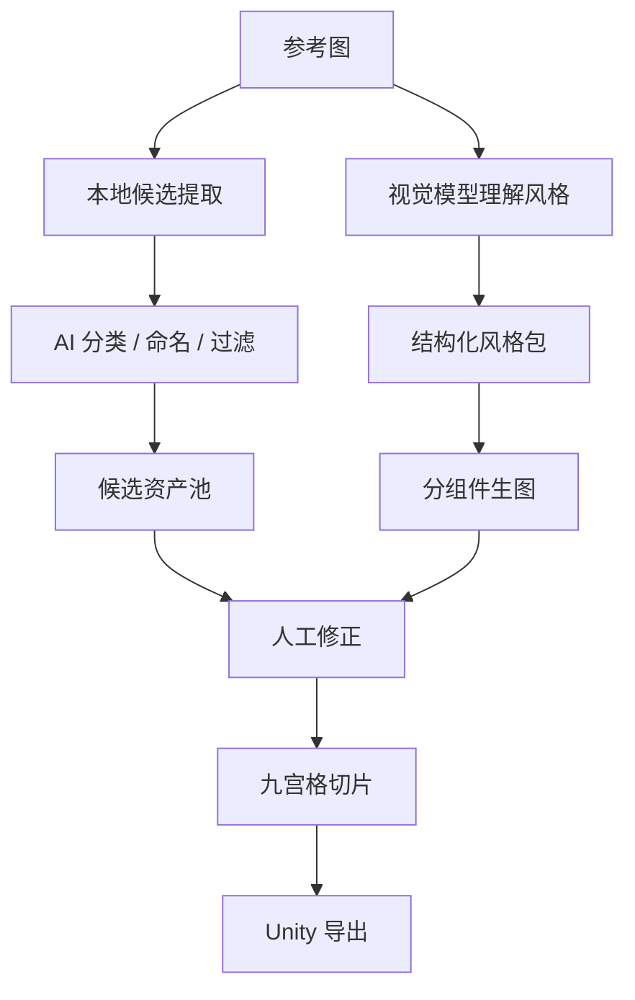

# 反复错误复盘：AI 接入、生图与节点工作流

更新日期：2026-06-25

这份文档专门记录这段时间反复卡住的问题。它不是甩锅清单，而是给后续开发用的“避坑地图”。这个项目的难点不在于某一个按钮，而在于多个不稳定外部 AI 平台、本地代理、浏览器限制、模型能力差异和产品预期混在一起，很容易让错误表象互相误导。

## 1. ModelScope 生图反复失败

### 现象

多次出现类似错误：

- `task not found`
- `404 page not found`
- `ModelScope 400: Bad Request`
- `Invalid model id`
- `image-gen task currently does not support synchronous calls`
- `You have exceeded today's quota 50 for image-gen model`
- 返回 `{ errors, request_id, task_status }`，但没有图片 URL 或 base64。

### 根本原因拆解

#### 1.1 同步/异步协议混淆

ModelScope 的部分生图接口不支持同步调用，必须设置：

```http
X-ModelScope-Async-Mode: true
```

早期请求没有稳定带上这个 header，导致接口明确返回：

```text
image-gen task currently does not support synchronous calls
```

#### 1.2 Base URL 与路径组合混乱

曾经出现过 Base URL 填成：

```text
https://api-inference.modelscope.cn
```

或：

```text
https://api-inference.modelscope.cn/v1
```

但前端/后端又把路径拼接为不同形式，导致请求打到入口页或错误路径。

典型表现：

```text
Welcome to the ModelScope API-Inference!
```

这说明请求并没有真正到达模型推理接口。

#### 1.3 request_id 和 task_id 混用

ModelScope 返回结构中可能同时出现：

- `task_id`
- `request_id`
- `task_status`

早期轮询逻辑尝试过用 `request_id` 去查询任务，导致大量：

```text
task not found
```

后续已调整为优先使用 `task_id`，但不同模型/接口返回结构仍需进一步做平台适配。

#### 1.4 轮询路径不确定

为了兼容，代码曾尝试多个路径：

- `/v1/tasks/{task_id}`
- `/v1/tasks/{task_id}/result`
- `/api/v1/images/generations/{task_id}`
- `/api/v1/images/generations/{task_id}/result`
- `/v1/images/generations?task_id=...`

这种“广撒网”能提高兼容概率，但也造成错误日志很长，不利于快速判断真正失败点。

下一步应该改成“按 provider + imageProtocol + modelCapability 精确选择协议”，而不是每次盲试多个路径。

#### 1.5 模型 ID 并不等于可用于该接口

例如用户填写：

```text
Qwen/Qwen-Image-2512
```

或其他模型名时，可能发生：

- 模型不存在。
- 模型存在但未开放 API-Inference。
- 模型支持推理但不支持 `/images/generations`。
- 模型需要特定任务接口，而不是 OpenAI-compatible image endpoint。

这类问题不是画布逻辑能解决的，必须在 AI 配置中增加“模型能力检测”和“推荐模型预设”。

#### 1.6 额度限制是真实生产约束

最终出现：

```text
You have exceeded today's quota 50 for image-gen model
```

这说明 ModelScope 链路已经能打到生图服务，但额度限制阻断了继续验证。

结论：ModelScope 可以保留，但不能作为唯一生产生图后端。必须支持平台切换、失败转移和本地/其他云端模型备选。

## 2. SiliconFlow 生图可用但质量不稳

### 现象

SiliconFlow 配置成功后，可以完成生图，但出现：

- 风格不像参考图。
- UI 组件变成角色贴纸、头像、动物头。
- 组件之间风格不统一。
- 图像质量偏低或不适合作为游戏切片。

### 根本原因

#### 2.1 单次整张组件板生成太难控

要求模型“一次生成一张包含多个 UI 组件的组件板”，会同时考验：

- 风格一致性。
- 组件类型理解。
- 排版。
- 背景透明/简洁。
- 每个组件的可切片边界。
- 不生成文字或乱码。
- 不复制参考图角色。

这对通用生图模型来说很容易跑偏。

#### 2.2 提示词曾经过度复制参考图内容

参考图里有独角兽、小猪、粉色游戏界面时，模型容易把“角色”当成主要风格元素，导致组件板里出现动物头像、IP 贴纸，而不是按钮、面板、进度条。

后续已加入约束：

```text
reference images are style references only, do not copy their characters, mascots, screenshots, layouts, text, or scene content
```

但只靠提示词不能完全解决，需要工作流策略升级。

#### 2.3 目前缺少自动评分与重生成

当前是“生成一次 → 使用结果”。生产级应改为：

1. 生成多张候选。
2. 用视觉模型检查是否是 UI 组件、是否包含多余角色、是否风格一致。
3. 选择最佳结果。
4. 不合格则自动修正提示词重试。

## 3. 多模态视觉理解曾经疑似未生效

### 现象

用户发现风格提示词并不像根据上传图片生成，而像固定模板。

### 根本原因

#### 3.1 视觉模型配置可能是文本模型

例如：

```text
Qwen/Qwen3.5-35B-A3B
```

这类模型未必支持图像输入。即使接口请求格式正确，模型也可能忽略图片或报错。

#### 3.2 早期没有强制“参考图证据”

如果只要求模型生成风格提示词，模型很容易凭空泛化。后来加入了“必须返回参考图证据”的约束，例如：

- Image 1 的顶部导航是什么形状。
- Image 2 的按钮有什么材质。
- Image 3 的角色/IP 有什么视觉特征。

这样可以更容易判断视觉理解是否真的发生。

#### 3.3 缺少模型能力测试

现在“测试连接”主要证明 API 可用，但不能证明：

- 文字模型可用。
- 视觉模型真的看到了图片。
- 生图模型可生成图片。
- 本地代理可下载并转换图片。

下一步应把测试连接拆成四个测试：

- 文本测试。
- 视觉测试。
- 生图测试。
- 本地代理下载测试。

## 4. 前端直连外部 AI 的问题

### 现象

出现过：

- `Failed to fetch`
- `signal is aborted without reason`
- 临时图片 URL 过期。
- API Key 暴露在浏览器 localStorage。

### 根本原因

浏览器端直接请求外部 AI 平台会受到：

- CORS 限制。
- 请求超时限制。
- 图片 URL 跨域下载限制。
- API Key 暴露风险。
- 异步任务轮询不稳定。

### 当前处理

已加入本地 Node 代理：

```bash
npm run api
```

默认地址：

```text
http://127.0.0.1:8787
```

建议生产使用时始终开启本地代理，把 API Key 放在后端环境变量中，而不是长期存在浏览器 localStorage。

## 5. AI 配置重启后回到 ModelScope

### 现象

用户切换到 SiliconFlow 后，重启项目又自动变回 ModelScope。

### 根本原因

项目快照里保存了旧 AI 配置，而全局 AI 配置和项目内 AI 配置存在优先级冲突。

### 当前处理

已改为：

- 全局 AI 配置优先。
- 根据 baseUrl、imageProtocol、imageModel 等字段推断 provider。
- providerKeys 分平台保存。
- 加载后回写规范化配置。

### 后续建议

AI 配置应该进一步拆为独立“Provider Profile”，不要嵌在项目快照中作为主要配置。项目只记录使用哪个 profile。

## 6. 本地回退掩盖真实失败

### 现象

AI 失败时，本地预览和本地组件板仍会生成，看起来流程成功，但实际 AI 没有成功。

### 好处

- 保证课堂演示和流程不崩。
- 用户可以继续操作，不会卡死。

### 问题

- 容易误以为 AI 已经成功。
- 不利于定位模型、额度、协议、API Key 问题。

### 后续调整

UI 应明确区分：

- `AI 成功`
- `AI 失败，已本地回退`
- `纯本地模式`

并在节点上用不同颜色和标签展示，而不是只显示 success/warning。

## 7. 自动拆解节点目前还不够“聪明”

### 现象

拆解出的组件库、IP、Icon、字体节点有时只是大块浅色区域，或者结果不符合预期。

### 当前原理

目前主要使用本地图像处理：

- 缩放图片。
- 计算亮度、饱和度、边缘/颜色跳变。
- 生成前景 mask。
- 膨胀 mask。
- 连通域检测。
- 根据尺寸、比例、位置粗分类。
- 裁切候选区域。
- 如果 AI 视觉模型可用，再分类和命名。

### 根本限制

UI 截图里的组件常常有：

- 浅色背景和浅色组件边界，局部对比度低。
- 大量半透明装饰。
- 文字、图标、按钮混在一个卡片内。
- 角色和 UI 组件重叠。
- 背景纹理和组件材质相似。

纯 Canvas 阈值法很难稳定拆出语义组件。

### 后续方向

应升级为“候选检测 + AI 视觉分类 + 人工修正”的组合，而不是期待一次自动拆完：

- 本地 CV 提供候选框。
- AI 视觉模型判断类别、保留/丢弃、命名。
- 用户可在画布中手动调整裁切框。
- 结果再进入切片和导出。

## 8. 画布整理逻辑曾经越整理越乱

### 现象

点击“整理”后，节点从原本比较自然的横向链路变成上下跳跃的大曲线。

### 根本原因

整理算法过于依赖拓扑层级，没有针对“左输入汇合 → 主链路横向展开”的产品工作流优化。

### 当前偏好

用户更喜欢默认排布：文本需求和参考图在左侧上下对齐，汇入设计风格包，然后主链路横向展开。

### 后续建议

整理算法应固定为：

- 输入节点列：文本需求、参考图组。
- 主干节点列：设计风格包、原子组件板、切片质检、Unity 导出。
- 拆解节点列：参考图右侧垂直排列。
- 自动对齐网格，减少大幅弯曲连线。

## 9. README 编码乱码

### 现象

终端读取 `README.md` 时出现乱码。

### 影响

影响交付观感，也会让后续维护者难以理解运行说明。

### 后续处理

需要用 UTF-8 重新整理 README，并把运行方式、AI 配置、常见问题写清楚。

## 10. 本阶段的核心经验

这段开发最大的经验是：AI 工作流产品不能只做“调用成功”，而要做“能力验证 + 失败解释 + 可回退 + 可人工修正”。

对于这个项目，真正稳定的生产路线应该是：



也就是说，生产级不是“AI 一键生成所有东西”，而是把 AI 放在风格理解、候选生成、分类命名、质量检查这些节点上，让人可以介入和修正。

