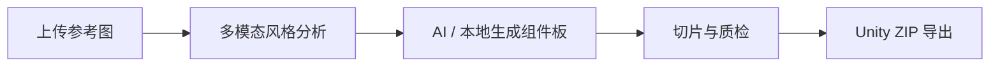
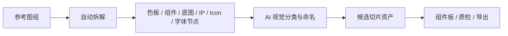

# StyleSlice 阶段性工作总结

更新日期：2026-06-25  
项目位置：`F:\Class-2026\设计计算2\课程作业\Task_Final\styleslice-mvp`

## 1. 项目目标回顾

StyleSlice 的目标是做一个面向游戏 UI 的网站式画布工具：用户上传 3-5 张参考图，系统通过视觉理解提取风格，再辅助生成游戏 UI 原子组件、切片资产和 Unity 可用导出包。

相比普通 App UI 生成，这个项目更关注“可生产使用”的游戏 UI 资源流：

- 从参考图学习风格，而不是只生成一张参考效果图。
- 生成按钮、面板、头像框、徽章、进度条、对话框等可复用组件。
- 把组件图切成 PNG 资产，并给出九宫格、命名、尺寸等建议。
- 以节点工作流方式组织：参考图、文本需求、风格包、组件板、切片质检、Unity 导出。
- 未来可扩展到界面生成、界面跳转关系梳理、批量资产生产、LoRA/本地模型工作流。

## 2. 当前已实现的主要功能

### 2.1 画布与节点系统

当前已经实现了基于 React Flow 的节点式工作台：

- 默认工作流：文本需求 / 参考图组 → 设计风格包 → 原子组件板 → 切片与质检 → Unity 导出。
- 支持节点拖拽、选择、复制、删除、运行。
- 支持自由连线，线拖到空白位置时弹出快捷创建节点面板。
- 支持 `Delete` 删除节点、快捷整理、运行节点等基础交互。
- 支持节点状态显示：等待、运行中、成功、警告、失败。
- 支持节点预览图，例如参考图、风格预览图、组件板、切片结果。

### 2.2 参考图节点

参考图节点已从“只显示一张图”升级为更适合多图风格学习的形式：

- 支持上传多张 PNG/JPG/WebP 图片。
- 节点上显示当前主图。
- 节点内显示缩略图小窗，可点击切换主图。
- Inspector 面板中也能查看多张参考图。
- 当前主图会作为部分拆解、分析和风格提取的重点输入。

### 2.3 设计风格包节点

设计风格包节点现在承担两个职责：

- 使用多模态视觉理解模型分析参考图，生成结构化风格包。
- 使用生图模型生成风格预览图；失败时回退为本地风格预览。

风格包内容包括：

- 色板。
- 材质语言。
- 形状语言。
- 装饰语言。
- 参考图证据。
- 正向结构化提示词。
- 反向提示词。
- 风格一致性评分。

经过多轮调整后，提示词已经从早期过于宽泛的“fantasy RPG UI kit”类描述，改为更依赖参考图证据的结构化风格描述。

### 2.4 原子组件板节点

原子组件板节点已从固定内置样式升级为：

- 优先调用 AI 生图模型，根据风格包生成 UI 组件板。
- 生成失败时回退为本地 Canvas 风格化组件板。
- 支持组件类型列表，例如按钮、面板、徽章、进度条、对话框、头像框、任务卡片、资源图标。
- 对生图提示词进行了约束：参考图只作为风格参考，不复制角色、吉祥物、截图内容或具体布局。

当前仍存在的核心问题是：不同平台/模型的生图质量与风格一致性差异很大，且某些模型容易生成角色贴纸，而不是 UI 组件。

### 2.5 切片与质检节点

当前切片节点支持：

- 从组件板中生成基础切片。
- 接收拆解节点输出的候选资产并转换为切片。
- 汇总上游多个节点的切片结果。
- 给出基础质检信息。

切片数据结构已经包括：

- 名称。
- 类型。
- 图片 dataURL。
- 原始尺寸。
- 建议九宫格边距。

### 2.6 Unity 导出

当前已经支持将切片结果打包为 ZIP：

- `sprites/` 目录保存 PNG 资产。
- `sprites.json` 保存元数据。
- `README.txt` 提供导入说明。

这部分已经具备 MVP 级别的生产闭环，但还需要增强命名规范、九宫格设置和批量导入说明。

### 2.7 AI 配置系统

AI 配置从单一 ModelScope 配置扩展为多平台配置：

- 支持 ModelScope 魔搭。
- 支持 SiliconFlow 硅基流动。
- 支持不同平台分别保存 API Key。
- 支持切换调用平台、文字模型、视觉模型、生图模型。
- 支持本地代理地址配置，默认 `http://127.0.0.1:8787`。
- 支持测试连接。
- 支持通过 `npm run api` 启动本地后端代理，避免前端直接请求导致 CORS、API Key 暴露和图片 URL 失效。

当前用户实际已经验证：SiliconFlow 生图链路可以运行成功；ModelScope 因额度、异步协议、模型 ID 和轮询路径问题曾反复失败。

### 2.8 项目管理

已增加基础项目管理能力：

- 项目名称可编辑。
- 可新建项目。
- 可复制项目。
- 可删除项目。
- 可打开项目。
- 可导出项目 JSON。
- 项目数据保存在浏览器 localStorage。

同时修复过一个关键问题：重启后 AI 配置会从 SiliconFlow 自动切回 ModelScope。现在通过全局 AI 配置优先和 provider 推断，尽量保持用户上一次选择的平台。

### 2.9 参考图拆解节点

已新增参考图拆解入口和一组拆解节点：

- 色板节点：提取色彩搭配。
- 组件库节点：尝试拆解 UI 组件区域。
- 底图节点：提取背景/底图候选。
- IP 节点：提取角色/IP 形象候选。
- Icon 节点：提取图标候选。
- 字体节点：提取文字/字体样本候选。

当前拆解逻辑是“本地计算机视觉候选切片 + AI 视觉分类”的混合策略：

1. 先用本地 Canvas 图像处理做候选区域检测。
2. 根据区域尺寸、位置、形状粗分类。
3. 如 AI 视觉模型可用，再把候选图交给视觉模型分类、过滤、命名。
4. 生成候选资产 contact sheet 和可导出的切片。

这是朝“通用自动识别”迈出的第一步，但还没有达到专业 UI 自动切图工具的稳定水平。

## 3. 当前代码结构

核心文件：

- `src/components/Workspace.tsx`：画布状态、项目管理、节点创建、连线、运行调度。
- `src/components/StudioNode.tsx`：节点卡片展示。
- `src/components/Inspector.tsx`：右侧属性面板。
- `src/components/AiSettingsPanel.tsx`：AI 平台与模型配置。
- `src/data/nodeRegistry.ts`：节点类型注册表。
- `src/lib/workflowRunner.ts`：节点执行器。
- `src/lib/modelscopeClient.ts`：AI 调用封装，虽然文件名仍叫 modelscopeClient，但实际已承载 ModelScope 和 SiliconFlow。
- `src/lib/imagePipeline.ts`：本地色板提取、组件板生成、图像拆解、切片。
- `server/index.mjs`：本地 Node 代理，负责调用外部 AI 平台、下载图片并转为 dataURL。
- `src/types/workflow.ts`：工作流、节点、AI 配置、切片等类型定义。

## 4. 当前整体状态判断

项目已经从“静态 MVP 演示”进入“可真实调用 AI 的本地生产工具雏形”阶段。

已经完成的闭环：

正在形成的新闭环：

但距离“正式生产可靠使用”还有几个关键差距：

- 生图模型的风格一致性和 UI 组件可控性还不够。
- 自动拆解还比较粗，需要更强的图像分割、检测和人工修正能力。
- AI 配置虽然可切换，但模型能力验证还不够明确，容易用文本模型承担视觉任务。
- 失败回退虽然提升了演示稳定性，但容易掩盖真实问题，需要更清晰地区分“AI 成功”和“本地回退”。
- README 编码出现过乱码，需要整理文档和交付说明。

